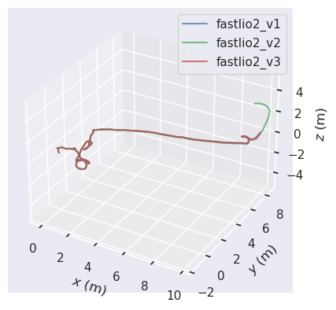
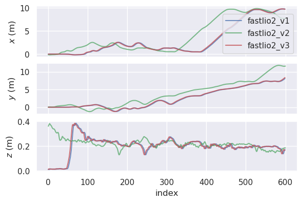
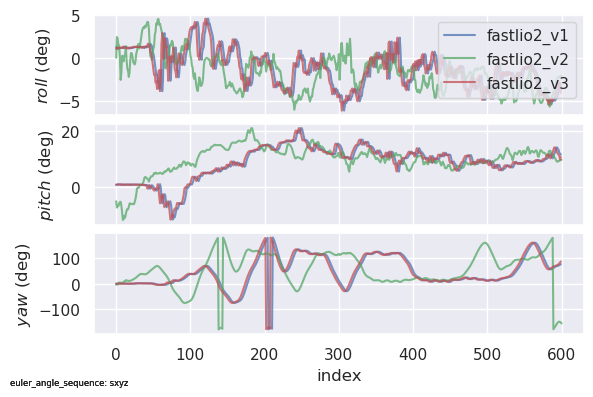

# Project_SLAM

## Environments

1. Ubuntu 22.04
2. ROS2 Humble

## Quick Start

1. Execute the script `install_env.sh` to prepare the environment.

    ```shell
    bash install_env.sh
    ```

    > You could also download each repositories and build them manually:
    >
    > - `Livox-SDK2`
    >
    > ```shell
    > git clone https://github.com/Livox-SDK/Livox-SDK2.git
    > cd Livox-SDK2/
    > mkdir -p build && cd build
    > cmake .. && make -j4
    > sudo make install
    > ```
    >
    > - `Sophus`
    >
    > ```shell
    > git clone https://github.com/strasdat/Sophus.git
    > cd Sophus
    > git checkout 1.22.10
    > mkdir -p build && cd build
    > cmake .. -DSOPHUS_USE_BASIC_LOGGING=ON && make -j4
    > sudo make install
    > ```
    >
    > - `gtsam`
    >
    > ```shell
    > git clone https://github.com/borglab/gtsam.git
    > cd gtsam
    > mkdir -p build && cd build
    > cmake .. && make -j4
    > sudo make install
    > ```
    >
    > - `livox_ros_driver2`
    >
    > ```shell
    > cd src/livox_ros_driver2
    > source /opt/ros/humble/setup.sh
    > bash build.sh humble
    > ```

2. Download the `rosbag` from [Baidu Drive](https://pan.baidu.com/s/1rTTUlVwxi1ZNo7ZmcpEZ7A?pwd=t6yb) | [Google Drive](https://drive.google.com/file/d/1i4dv1OYUWAe8PM3j4Wgpmw05ATLcE2a6/view), and then move it to `temp/fast_lio2_ros2/`

3. Use colcon to build all packages

   ```shell
   cd fast_lio2_ros2
   colcon build --paths src/*
   ```


4. Run `fast_lio2_ros2`

   ```shell
   cd fast_lio2_ros2

   # terminal 1
   source install/setup.bash
   ros2 bag play <ros2-bag>
   
   # terminal 2
   source install/setup.bash
   ros2 launch fastlio2 lio_launch.py
   ```

5. Run `fast_lio2_ros2_v2` (with [Degenerate-Detection](https://ieeexplore.ieee.org/abstract/document/10610340))

   ```shell
   cd fast_lio2_ros2

   # terminal 1
   source install/setup.bash
   ros2 bag play <ros2-bag>
   
   # terminal 2
   source install/setup.bash
   ros2 launch fastlio2 fastlio2.launch.py
   ```

6. Run `fast_lio2_ros2_v3` (with `SC-PGO`)

   ```shell
   cd enhanced_fast_lio2_ros2

   # terminal 1
   source install/setup.bash
   ros2 bag play <ros2-bag>
   
   # terminal 2
   source install/setup.bash
   ros2 launch fastlio2 fastlio2_pgo.launch.py
   ```

## Testing Data

- You can download the preprocessed **ros2bag** file from  [Baidu Drive](https://pan.baidu.com/s/1rTTUlVwxi1ZNo7ZmcpEZ7A?pwd=t6yb) | [Google Drive](https://drive.google.com/file/d/1i4dv1OYUWAe8PM3j4Wgpmw05ATLcE2a6/view)

- You can also download the **ros1bag** provided by [FAST_LIO](https://github.com/hku-mars/FAST_LIO?tab=readme-ov-file#4-rosbag-example) from [Google Drive](https://drive.google.com/drive/folders/1CGYEJ9-wWjr8INyan6q1BZz_5VtGB-fP?usp=sharing), and then convert them to `ros2bag` format using the scripts below:

  ```shell
  pip install rosbags
  rosbags-convert --src <ros1-bag> --dst <ros2-bag>
  ```

## Results





## Acknowledge

- https://github.com/hku-mars/FAST_LIO
- https://github.com/Livox-SDK/Livox-SDK2
- https://github.com/Livox-SDK/livox_ros_driver2
- https://github.com/strasdat/Sophus
- https://github.com/liangheming/FASTLIO2_ROS2
- https://github.com/jisehua/Degenerate-Detection
- https://github.com/MichaelGrupp/evo
