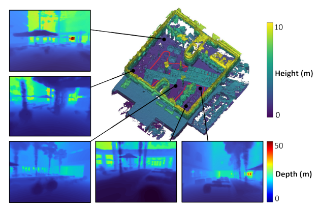
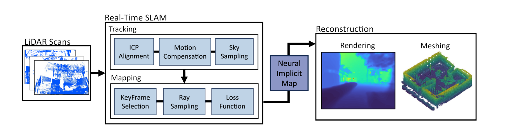
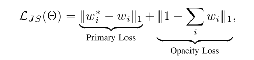
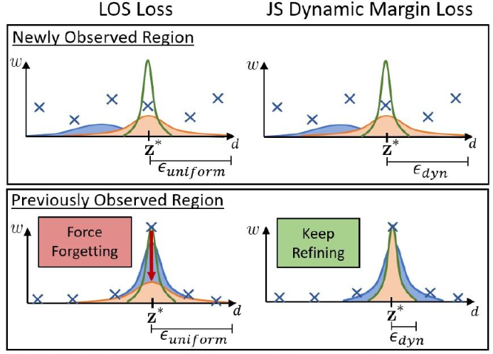
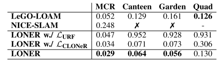
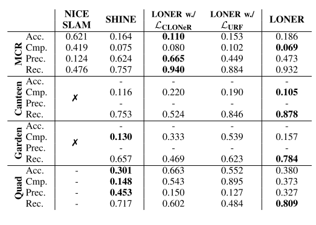
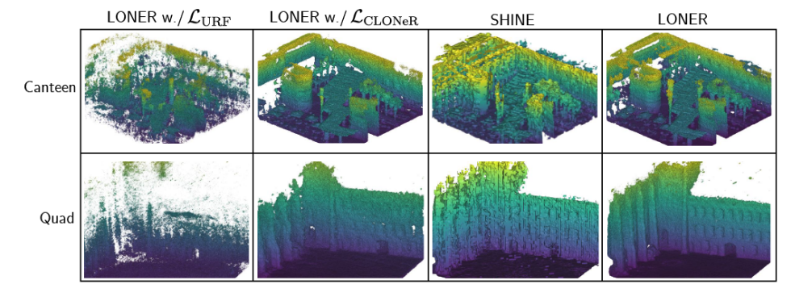
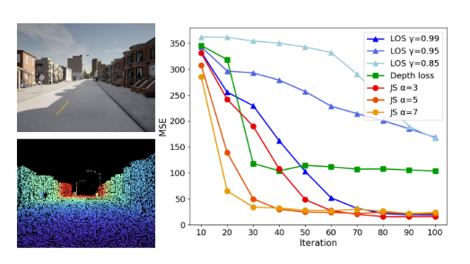
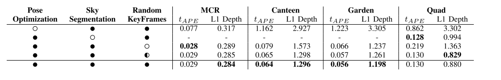
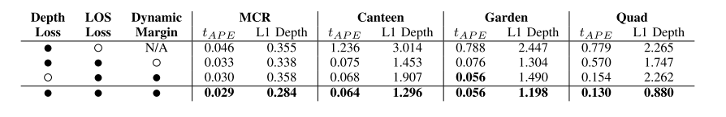

# Document

## NeRF（神经辐射场）

NeRF（Neural Radiance Fields，神经辐射场）最早是在2020年ECCV会议上的最佳论文中提出的概念，其将隐式表达推上了一个新的高度，仅用2D的posed images作为监督，即可表示复杂的三维场景。传统的NeRF采用MLP来估计空间中的每个点的辐射和体积密度，实现密集场景重建和视图合成。

### NeRF的优势

传统的三维重建有很多缺点，例如最终重建的模型中可能会有孔洞、纹理混叠、由于体素分辨率限制丢失很多细节。而NeRF可以合成照片级别的新视角，重建的模型细节更加丰富,它通过使用稀疏的输入视图集优化底层连续的体积场景函数，实现了综合复杂场景视图的最好结果，无空洞、细节还原，且由于研究的人多，发展也尤为迅速。同时NeRF的域是连续的并且不强制离散化，可以查询场景中的任何点的占用。

### NeRF的应用

神经辐射场目前广泛用于3D建模、自动驾驶、导航系统等领域。NeRF 可以用来创建高度精细的 3D 场景，增强沉浸式体验。在 AR 应用中，NeRF 可以用来创建更加逼真的虚拟物体，还原文物等模型。

# 第一个基于NeRF的实时LiDAR SLAM---------- LONER

NeRF结合SLAM是这两年很新兴的方向，但是也非常难。一方面是NeRF本身训练慢渲染慢很难达到实时，另一方面是现在大多NeRF SLAM的定位精度很难和传统SLAM相比，还有一些对运行GPU要求高、落地难等等的问题。而且由于NeRF本身更偏向于室内场景，所以很多NeRF SLAM都没办法做室外。LONER，宣称是第一个基于NeRF的实时纯雷达SLAM，而且定位精度和建图质量都很高。
现有的隐式的映射方法存在的两个主要的问题：1.需要地面实况姿态。2.运行速度慢于实时
本文的实时性的实现主要是是通过提出一个新的信息熵损失函数来实现的。同时LONER的轨迹估计也能和一些SOTA模型表现差不多。同时能够产生和用了groundtruth的隐式映射方法差不多效果的dense map

## 效果展示

先来看看LONER的建图效果，右上角是Mesh地图，红色是轨迹，其他图像是新视点合成的深度图。LONER在训练NeRF以后，可以将NeRF地图离线渲染为Mesh和深度图。整个建图和深度渲染的效果还是很好的。

## 论文摘要

本文提出了LONER，第一个使用神经隐式场景表示的实时激光雷达SLAM算法。现有的激光雷达隐式建图方法在大规模重建中显示出有希望的结果，但要么需要地面真实姿态，要么比实时运行慢。相比之下，LONER使用激光雷达数据训练MLP实时估计密集地图，同时估计传感器的轨迹。为了实现实时性能，本文提出了一种新的信息论损失函数，该函数考虑了在整个在线训练中地图的不同区域可能被学习到不同程度的事实。该方法在两个开源数据集上进行了定性和定量评估。该评估表明，与深度监督神经隐式框架中使用的其他损失函数相比，所提出的损失函数收敛更快，并且导致更精确的几何重建。最后，本文表明，LONER估计轨迹与最先进的激光雷达SLAM方法相比具有竞争力，同时也产生了与使用地面真实姿态的现有实时隐式映射方法相比具有竞争力的密集地图。

## 算法解析

LONER是一个**纯LiDAR算法**，也没有使用IMU。雷达扫描首先降采样（将为5 Hz），然后用ICP跟踪，并从场景几何中分割出天空。对于建图线程，是使用当前关键帧和随机选择的过去关键帧来更新，并维护一个滑窗来优化。跟踪和建图两个线程并行运行，但是建图线程的帧率较低，并准备**关键帧用来训练NeRF**。最后使用作者专门设计的损失函数来更新位姿和MLP权重，生成的隐式地图可以离线渲染为各种格式，比如深度图和Mesh。

作者在跟踪线程里直接使用了Point-to-Plane ICP算法来估计位姿，并在mapping线程里优化，没有使用MLP估计位姿，主要还是为了降低计算量达到实时。运动补偿还使用了恒速模型假设。

NeRF渲染这一块，就是用传统的分层特征编码渲染体密度，体渲染过程和NeRF一样。

损失函数这里作者使用的trick比较多，包括一个**JS损失、一个深度损失、还有一个sky损失**。

JS损失是在LOS损失（参考Urban radiance fields这篇文章）上改的，LOS损失给每条射线的余量都是一样的，并且在整个训练中呈指数衰减。JS损失的公式和LOS一样，但是基于JS散度给每条射线设置了加权余量，来提高训练收敛和重建精度。

再来看看这么做的**具体数学机理**，LOS损失迫使学习区域预测更高的方差来破坏学习信息。相反，所提出的JS损失根据目标分布和预测样本分布之间的相似性来设置每条射线的动态余量ϵ。JS损失可以为未观察到的区域中的光线设置较高的余量来改善收敛，并为已学习区域中的光线设置较低的余量以改进已学习的几何图形。所以JS损失要优于LOS损失。

深度损失，就是计算渲染深度和LiDAR深度之间的L2损失。

最后还有一个**sky损失，是为了应对室外NeRF的无边界问题，主要思想是强制指向天空的光线权重为零**。具体做法是将每次扫描转换为深度图像，过一次扩张和腐蚀过滤，抑制空点。

最后，可以将生成的NeRF**离线**渲染为Mesh，注意**这一部分不在online训练**里。具体的转换过程是，在关键帧位置设定虚拟雷达，然后沿着LiDAR射线计算权重，将权重存储到3D网格中。如果多个权重落在同一个网格单元，就保留最大值。

## 实验

对比的Baseline包含两部分，一个是跟NICE-SLAM和Lego-LOAM对比精度，一个是借用CLONeR和URF的损失函数来验证它自己损失的有效性。使用的数据集包括Fusion Portable和Newer College两个，两个数据集都没有什么动态对象。实验设备是AMD Ryzen 5950X  CPU和一块NVidia A6000 GPU。

首先是一个跟NICE-SLAM和Lego-LOAM的精度对比**，LONER的精度明显优于Lego-LOAM，这个还挺惊讶的，因为本身LONER没有为SLAM设计什么特殊的模块。而NICE-SLAM的精度明显比其他两个低，还容易跟丢，这也很容易理解，因为NICE-SLAM本身就是为室内场景设计的。这个实验也证明了LONER自身的损失函数是有效的。

然后是一个**地图重建性能的定量评估**，包括准确性(估计地图中每个点到真值中每个点的平均距离)和完整性(真值地图中每个点到估计地图中每个点的平均距离)。LONER效果也很不错。

**对于建图的定性评估**，LONER可以恢复更精细的细节并生成鬼影更少的地图

**损失函数收敛速度的对比**，评估单次扫描进行训练时每个函数的收敛性。使用CARLA模拟器，计算渲染深度图像的均方误差。结果表明JS损失比其他损失收敛得快。

两个消融实验。分别**对比SLAM和损失函数的组合**对性能的影响。具体指标是比较渲染深度与激光雷达深度来评估L1深度损失，这一点和NeRF框架中常用的L1深度很像。

最后就是运行速度，作者报告的是**每次跟踪平均需要14ms**，每个关键帧分配50次迭代，每3秒添加一个关键帧。执行50次迭代的平均时间是2.79秒，每次迭代大约56毫秒。因此，**地图以大约18Hz的频率更新，并且系统在每个关键帧分配的3秒内完成处理一个关键帧**，整体上看是达到了实时。